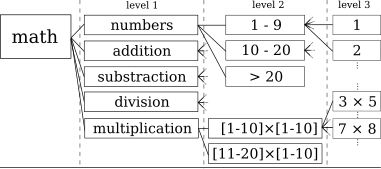
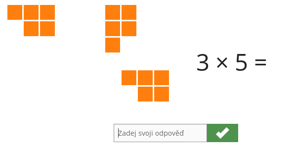
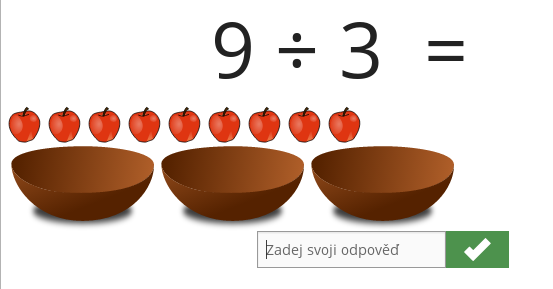

# MatMat data set

[MatMat](https://matmat.cz)

## skills.csv

The skills are organized in a tree structure. 
Note that only some of *the level 2 skills* have children. 

 

 - **id**
 - **identifier** - string identifier of the skill
 - **name** - czech name of the skill
 - **parent** - parent skill id

## items.csv

Every item belongs to exactly one skill (mostly level 2 or level 3 skills). 
Features 'skill_lvl_X' stands for ancestor skill of item on given level. 
they can be used for comfortably item filtering. 

 - **id**
 - **question** - human readable question represented by item
 - **answer** - human readable correct answer to item
 - **visualization** - type of visualization of question
 - **skill** - the smallest skill containing the item
 - **skill_lvl_X** - skill on the level 'X' containing the item
 - **data** - JSON with information about question and answer

## answers.csv
 - **id**
 - **time** - time of the answer
 - **item** - id of the item
 - **student** - id of the user
 - **response_time** - time taken to answer an item in milliseconds
 - **correct** - 0 for incorrect answer and 1 for correct answer
 - **answer** - answer given by the user
 - **answer_expected** - expected answer
 - **log** - JSON with addition information about answer
    - device used by the user
    - log of the user actions during solving the item
 - **random** - 0 for adaptively selected items and 1 randomly selected items 

## Visualizations

### written_question

### object_counting
 

### object_counting_with_numbers
 

### object_selection_answer
 

### number_line_answer
 

### multiplication_visualization_field
 

### division_visualization_baskets
 

